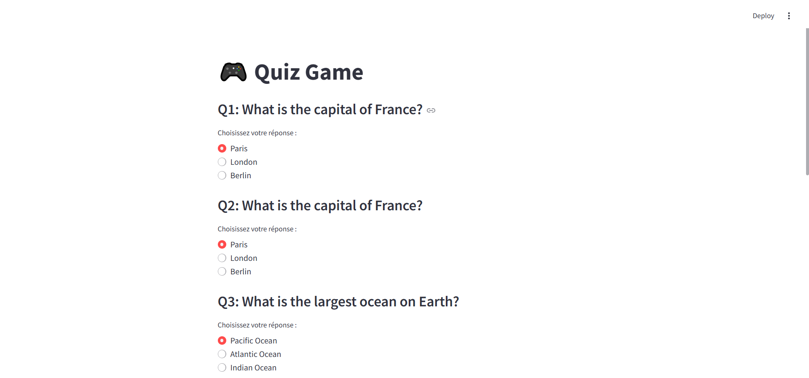
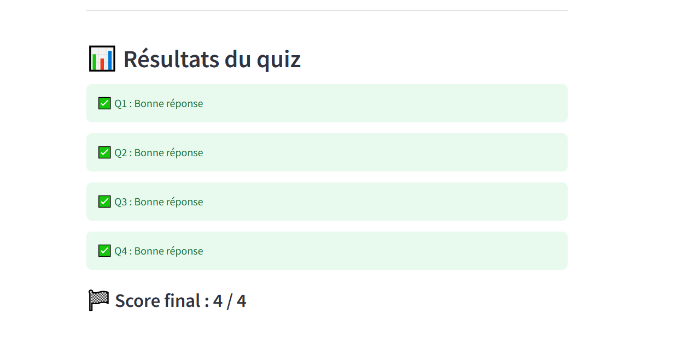

# 🎮 Quiz Game – FastAPI & Streamlit


Un mini projet de quiz interactif utilisant **FastAPI** pour le backend et **Streamlit** pour le frontend.

> 🚀 Les utilisateurs peuvent répondre à des questions à choix multiples, soumettre leurs réponses, et voir leur score final.

---

## 📦 Stack utilisée

- **FastAPI** – API rapide pour gérer les questions et réponses
- **SQLAlchemy** – ORM pour interagir avec la base de données SQLite
- **Streamlit** – Interface utilisateur simple pour lancer le quiz
- **SQLite** – Base de données légère (locale)

---

## 🎯 Fonctionnalités

- 📚 Liste de questions à choix multiples
- ✅ Sélection d'une réponse par question
- 📊 Affichage du score final
- 📥 Ajout de questions via l'API FastAPI

---

## 🛠️ Installation

1. **Cloner le dépôt** :
   ```bash
   git clone https://github.com/ton-utilisateur/quiz-game.git
   cd quiz-game

